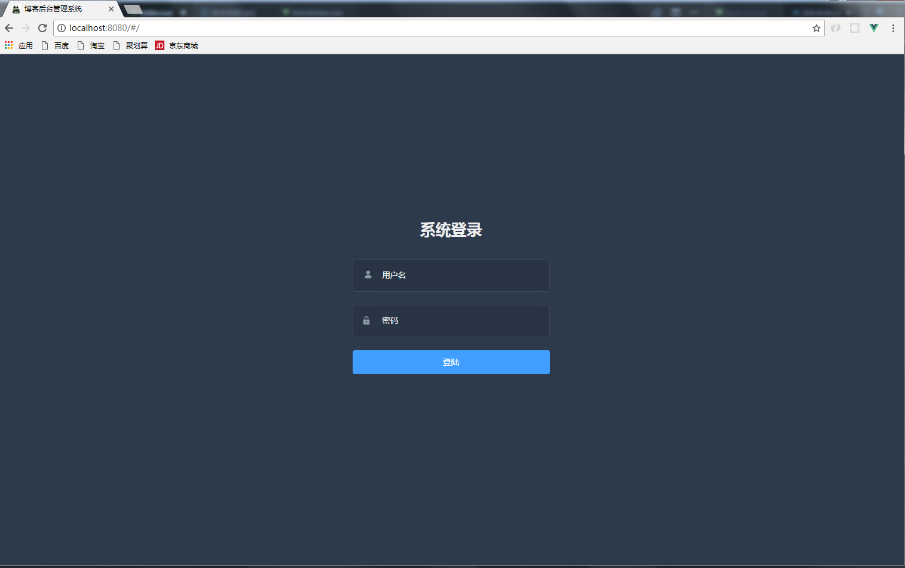
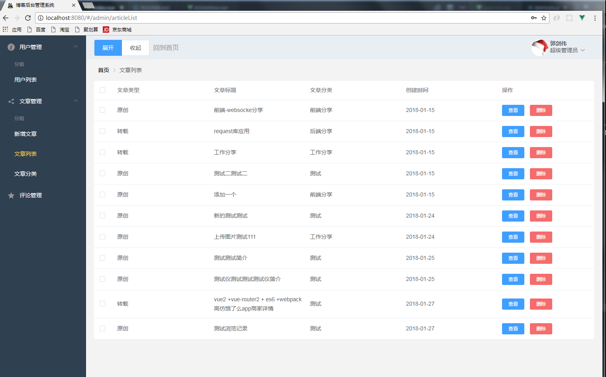
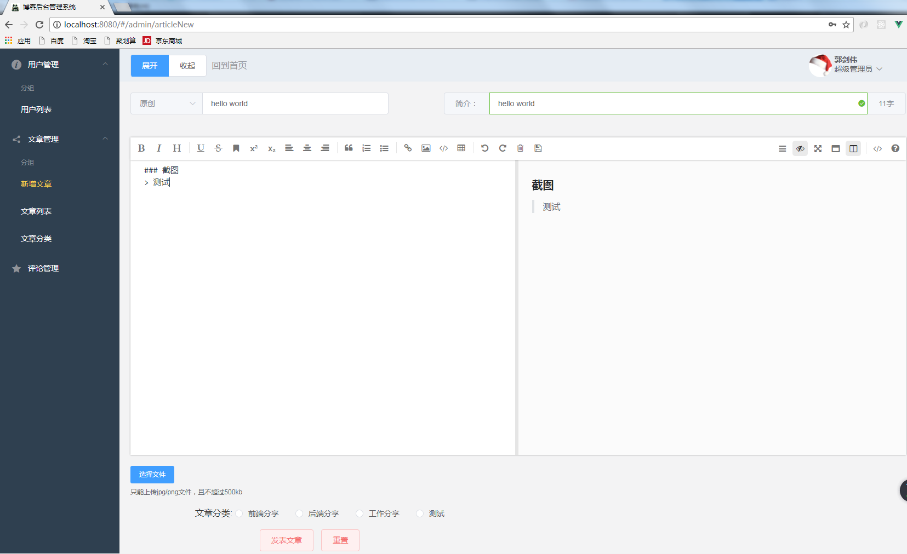

## 个人博客系统 --- 服务器部分

> 分为三部分: 

1. 前台： 博客页面
2. 后台： 博客管理页面
3. 后台： 博客后台服务器

****

### 项目简介

> 项目已前后端分离开发。分别用到的框架如下:
* 前台页面用nuxt + axios开发  
GITHUB源码地址:  [blog-website-nuxt](https://github.com/oxgos/blog-website-nuxt)

* 后台页面用vue2 + axios + vue-router + element-ui开发  
GITHUB源码地址:  [blog-admin](https://github.com/oxgos/blog-server-web)

* 后台服务器nodejs + express + mongodb开发  
GITHUB源码地址:  [blog-server](https://github.com/oxgos/blog-server)

****

### 项目预览图





****

### 完成功能
1. 用户增删改查接口
2. 用户权限管理
3. 上传图片
5. 文章增删改查
6. 文章分类管理
7. 文章分类统计
8. 前台文章浏览数统计
9. 前台文章分页功能

****

### TODO
1. 博客注册功能
2. 用户评论管理功能
3. 评论提醒
4. 图表统计
5. Banner图管理功能

****

``` bash
# 安装项目依赖
npm install

# 导入数据库
mongorestore -h 127.0.0.1:27017 -d blog 你的本地路径(数据库文件在这项目的database文件夹里)

# 启动项目于localhost:3000
node ./bin/www

# 登陆
帐号：admin
密码： admin
```
